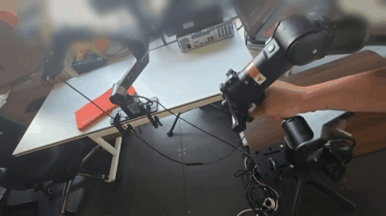
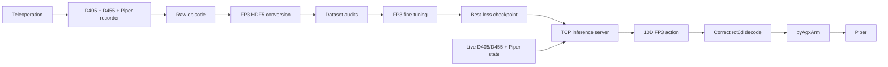

# Piper FP3 Pipeline

[English] | [简体中文](README.zh-CN.md)


End-to-end integration for **AgileX Piper + Intel RealSense D405/D455 + FP3**:
data collection, camera-local point-cloud conversion, dataset audits, FP3
fine-tuning, TCP inference, and physical robot execution.

> This repository is an integration layer. It does not vendor the upstream FP3
> source tree, pretrained FP3 weights, robot datasets, or third-party SDKs.


## Current Status

- [x] Piper leader-follower teleoperation
- [x] D405 + D455 RGB-D recording
- [x] FP3 HDF5 conversion
- [x] Dataset/action audits
- [x] FP3 LoRA fine-tuning
- [x] Physical Piper inference pipeline
- [x] Correct FP3 rot6d to Piper pose decoding
- [ ] Robust towel-folding policy
- [ ] Larger demonstration dataset
- [ ] Quantitative evaluation

## Demo

### Teleoperation Demonstration

Leader-to-follower teleoperation demonstration for the towel-folding task.



[View higher-quality MP4](assets/teleoperation_demo_privacy.mp4)

### FP3 Policy Rollout

Live FP3 policy inference and physical rollout on the Piper robot.


[View higher-quality MP4](assets/fp3_rollout_privacy.mp4)

> Demo media has been privacy-processed: non-essential background regions are blurred and the public video versions contain no original audio.

## What this repository solves

The pipeline connects the full robot-learning lifecycle:



## Supported development setup

- AgileX Piper
- wrist Intel RealSense D405
- external Intel RealSense D455
- Windows robot computer
- remote NVIDIA RTX 4090-class training/inference host
- FP3 / 3D Foundation Policy installed separately
- `pyAgxArm` for Piper control

## Install integration dependencies

Windows robot computer:

```powershell
pip install -r requirements-windows.txt
```

Remote FP3 host:

```bash
pip install -r requirements-remote.txt
```

FP3 / 3D Foundation Policy, OpenPoints, and robomimic are source dependencies and must be installed from their corresponding source repositories. They are intentionally not vendored or installed by these requirements files.

## Repository structure

```text
.
├── config/
│   ├── pipeline.example.json
│   └── pipeline.local.json      # ignored by git
├── data/
│   ├── raw/
│   ├── processed/
│   └── h5/
├── docs/
│   ├── ARCHITECTURE.md
│   ├── DATASET_SCHEMA.md
│   ├── HARDWARE.md
│   ├── PIPELINE.md
│   └── RELEASING_DATA_AND_MODELS.md
├── remote/
│   ├── 02_convert/
│   ├── 03_train/
│   ├── 04_inference/
│   └── scripts/
├── windows/
│   ├── 01_collect/
│   ├── 05_robot/
│   └── scripts/
├── tests/
├── tools/
├── pipeline.ps1
├── THIRD_PARTY_NOTICES.md
└── LICENSE
```

## Quick start

### 1. Configure local paths

Copy/edit:

```text
config/pipeline.local.json
```

This file is excluded by `.gitignore`.

### 2. Collect one demonstration on Windows

```powershell
.\pipeline.ps1 collect -Episode 21 -Duration 30
```

### 3. Upload the episode

```powershell
.\pipeline.ps1 upload -Episode 21
```

### 4. Convert and audit on the RTX host

```bash
cd ~/piper-fp3-pipeline/remote/scripts
./pipeline_remote.sh prepare
```

### 5. Fine-tune FP3

```bash
./pipeline_remote.sh train
```

Current experiment policy:

- 2000 epochs
- 5 optimizer steps / epoch
- 10000 optimizer steps total
- learning rate `1e-4`
- EMA enabled
- retain only `model_best_train_loss.pth`

The retained checkpoint is replaced only when a new global minimum epoch
training loss is observed.

### 6. Serve the model

```bash
./pipeline_remote.sh serve
```

The wrapper intentionally keeps `replan_every_step` disabled by default so the
policy can execute its action chunk instead of clearing the queue every step.

### 7. Run the physical Piper client

```powershell
.\pipeline.ps1 run
```

The current client includes:

- Piper firmware family `V189`
- camera-local D405 + D455 live point clouds
- FP3 row-based 6D rotation reconstruction
- no legacy fixed-Hz rollout scheduler
- startup joint-state capture
- `Ctrl+C` stops policy commands and returns to the startup joint pose

## Dataset design

The converted policy action is 10-D:

```text
abs_pos             3
abs_rot_6d          6
gripper_position    1
```

See [`docs/DATASET_SCHEMA.md`](docs/DATASET_SCHEMA.md) for the exact HDF5 and
rotation conventions.

## Why data and weights are not committed

Git is the wrong storage layer for the real RGB-D episodes and multi-GB
checkpoints. This repository therefore publishes the **complete data pipeline**
rather than committing the complete dataset bytes.

For reproducibility, release datasets/models separately and publish:

- manifest
- task description
- episode count
- data schema
- preprocessing configuration
- model metadata
- SHA256 checksums
- external download location

See [`docs/RELEASING_DATA_AND_MODELS.md`](docs/RELEASING_DATA_AND_MODELS.md).

## Public-release check

Before pushing:

```bash
python tools/public_release_check.py
```

It rejects common private keys/tokens, model/HDF5 files, and oversized files.

## Third-party software

This repository does not redistribute FP3 or pyAgxArm. See
[`THIRD_PARTY_NOTICES.md`](THIRD_PARTY_NOTICES.md).

## Citation

See [`CITATION.cff`](CITATION.cff).

## License

Original integration code in this repository is released under the MIT License.
Third-party projects retain their own licenses and terms.
