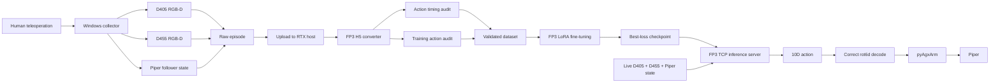

# Architecture

```mermaid
flowchart LR
    A[Human teleoperation] --> B[Windows collector]
    B --> C[D405 RGB-D]
    B --> D[D455 RGB-D]
    B --> E[Piper follower state]
    C --> F[Raw episode]
    D --> F
    E --> F
    F --> G[Upload to RTX host]
    G --> H[FP3 H5 converter]
    H --> I[Action timing audit]
    H --> J[Training action audit]
    I --> K[Validated dataset]
    J --> K
    K --> L[FP3 LoRA fine-tuning]
    L --> M[Best-loss checkpoint]
    M --> N[FP3 TCP inference server]
    O[Live D405 + D455 + Piper state] --> N
    N --> P[10D action]
    P --> Q[Correct rot6d decode]
    Q --> R[pyAgxArm]
    R --> S[Piper]
```

The GPU server never directly talks to the Piper CAN bus. The Windows client is
the hardware-facing process; the RTX host is the policy inference process.
